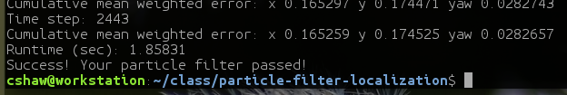

# Particle Filter Localization

This is my submission project for Udacity's self-driving car program related to the 
[Kidnapped Vehicle Project](https://github.com/udacity/CarND-Kidnapped-Vehicle-Project).  There
are no surprises on how to build it, and there are no surprises on how to run it.  

The general idea of the solution is as follows:

 0. Initialize particles with initial position, orientation and noise
 1. Update particle position based on current particles, their orientation and noise  
 2. For each particle, determine landmarks within sensor range
 3. Map particle observations to map coordinates
 4. Compute particle weight using vectors to the observation and landmark (distance and angle error)
 5. Resample particle weights
 6. Repeat 1 - 5 for each observation 

I found that using 50 particles is reliable in estimating the positions within the
tolerances desired for the project.  That is to say, I have run it >10 times in a row
with no failures.  10 particles does fail sporadically with my code, and there is a non-zero chance
that 50 would as well, just more remote.  Here is what it produces:

The algorithm was implemented extremely simply in an imperative style without a lot of attention to 
performance since it performs well within the expected time.  However, there is 
a lot of opportunity for improvement. Some of the problems with loop unrolling, inlining, etc.,
are addressed quite respectably by using -O3 optimization.  This is only added to the CMake file 
for GCC since I am not developing in an environment for testing other compilers.  Doing so 
makes it quite possible to run 1000 particles in the allotted time.  However, since 50 particles
does the job reliably, I am leaving it since it is much faster to execute.  

I decided to use the Mersenne Twister generator because it is a better linear conguence generator, 
albeit potentially slightly more expensive.  In the update step, while it is certainly more 
accurate to use the full computation including yaw rate for the update, it actually doesn't make a huge 
difference in the outcome; it speeds it up, albeit fairly negligably, and the error introduced 
into the particle's positions is small in comparison with the noise.  Probably best to leave it 
in the more correct form, but given the noise and tolerance of this project it isn't really 
required.  I also made a couple minor changes in other parts of the project, for example in 
`main.cpp` a choice of index variable for consistency.

